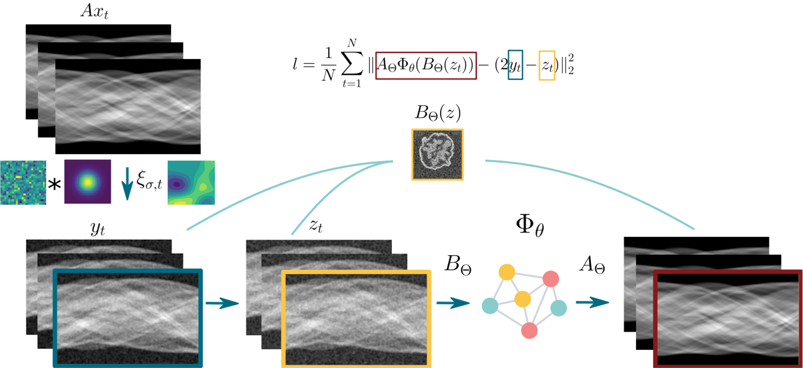

# 📜 Noisier2Inverse: Self-supervised learning for one-step reconstruction of noisy inverse problems with correlated noise

*A deep learning framework for denoising and reconstructing medical images using self-supervised learning specifically designed for correlated noise.*


---

## 📂 Repository Structure  

---
## Workflow Diagram



## 🚀 Installation  
### **1️⃣ Clone the Repository**  
```bash
git clone https://github.com/Nadja1611/Noisier2Inverse-Joint-Denoising-and-Reconstruction-of-correlated-noise.git
cd Noisier2Inverse
```
### **2️⃣ Create an environment and install LION** 

Install the LION package from [https://github.com/CambridgeCIA/LION](https://github.com/CambridgeCIA/LION)
```bash
cd ..
git clone https://github.com/CambridgeCIA/LION.git
cd LION
git submodule update --init --recursive
conda env create --file=env.yml
conda activate LION
pip install .
```

